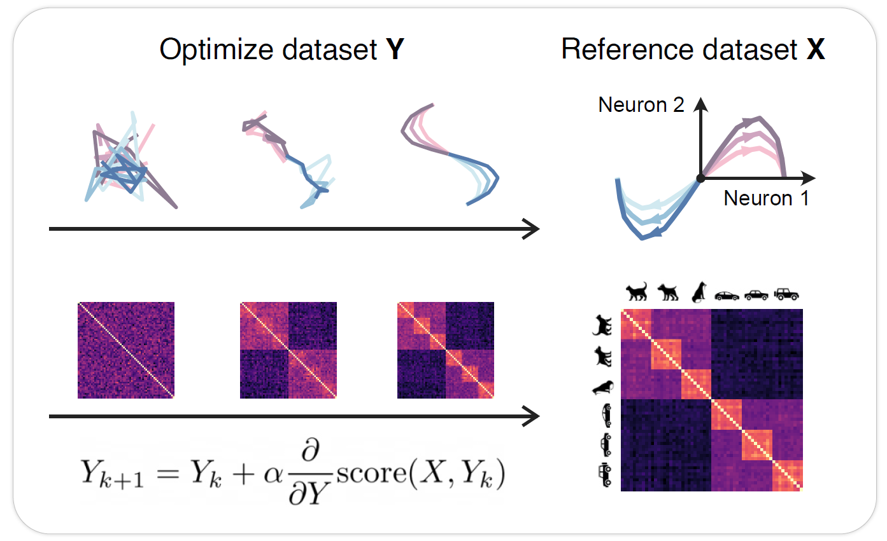
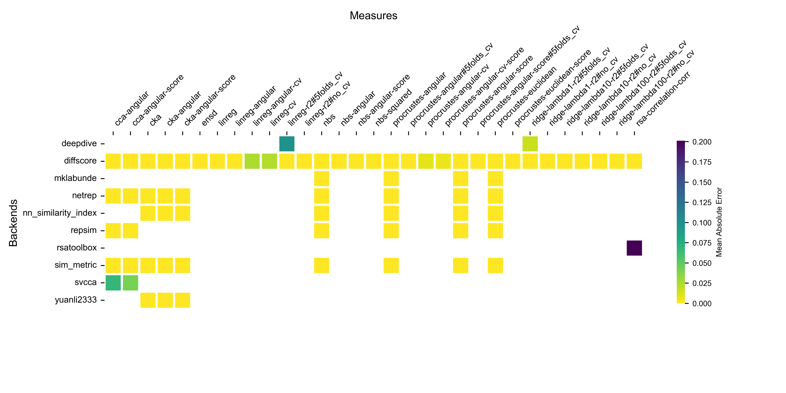

```js
import * as d3 from "npm:d3";
```

<link href="https://fonts.googleapis.com/css?family=Google+Sans|Noto+Sans|Castoro" rel="stylesheet">
<link rel="stylesheet" href="https://cdnjs.cloudflare.com/ajax/libs/font-awesome/4.7.0/css/font-awesome.min.css">

<style>

.content {
  display: flex;
  flex-direction: column;
  /* Align items to the left */
  align-items: flex-start;
  /* Center the content horizontally */
  margin-left: auto;
  margin-right: auto;
  /* Set a maximum width for the content */
  max-width: 900px; 
  font-family: 'Noto Sans', sans-serif;
}

.content p, .content h3, .content h2, .content h1 {
  max-width: none;
}

.content h2 {
  margin-top: 30px;
  margin-bottom: 10px;
}

.content h3 {
  margin-top: 5px;
  margin-bottom: 10px;
}

.content p {
  text-align: justify;
  margin: 0;
}

.content .title, .content .authors, .content .affiliations{
  max-width: none;
  margin-right: auto;
  margin-left: auto;
  text-align: center;
}

.content .title {
  margin-top: 50px;
  font-size: 40px;
}

.content .authors {
  display: flex;
  justify-content: center; /* Center the authors horizontally */
  flex-wrap: wrap; /* Ensure the list wraps if space is insufficient */
  column-gap: 30px; /* Space between author names */
  row-gap: 10px; /* Space between author names */
  margin-top: 10px;
  margin-bottom: 0;
  font-style: normal;
  color: #444;
  text-align: center;
}

.content .affiliations {
  display: flex;
  justify-content: center; /* Center the authors horizontally */
  flex-wrap: wrap; /* Ensure the list wraps if space is insufficient */
  gap: 25px; /* Space between names */
  margin-top: 10px;
  margin-bottom: 10px;
  color: #888;
  text-align: center;
  font-size: smaller;
}

.content .abstract {
  max-width: 600px;
  margin: auto;
}

.content .observablehq--block {
  /* TODO?: margin: auto; */
  margin-top: auto;
  margin-bottom: auto;
}

.content .github-link {
  margin-top: 20px;
  text-align: center;
  margin: auto;
}

.content .github-link a {
  display: inline-flex;
  align-items: center;
  justify-content: center;
  background-color: #f5f5f5; /* Light color background */
  color: #333;
  padding: 8px 12px;
  border-radius: 5px;
  text-decoration: none;
  font-size: 16px;
  border: 1px solid #ccc; /* Optional: adds a subtle border */
  margin-top: 25px;
}

.content .github-link a:hover {
  background-color: #e9e9e9;
}

.content .github-link img {
  margin-right: 8px;
}


</style>


<div class="content">
<h1 class="title">Differentiable Optimization of Similarity Scores Between Models and Brains</h1>

<!-- <h2 class="authors">Nathan Cloos, Markus Siegel, Scott L. Brincat, Earl K. Miller, Guangyu Robert Yang, Christopher J. Cueva</h2> -->
<div class="authors">
  <span>Nathan Cloos<sup style="font-size: 10px">1</sup></span>
  <span>Moufan Li<sup style="font-size: 10px">2</sup></span>
  <span>Markus Siegel<sup style="font-size: 10px">3</sup></span>
  <span>Scott L. Brincat<sup style="font-size: 10px">1</sup></span>
  <span>Earl K. Miller<sup style="font-size: 10px">1</sup></span>
  <span>Guangyu Robert Yang<sup style="font-size: 10px">1</sup></span>
  <span>Christopher J. Cueva<sup style="font-size: 10px">1</sup></span>
</div>

<div class="affiliations">
  <p><sup style="font-size: 10px">1</sup>MIT BCS</p>
  <p><sup style="font-size: 10px">2</sup>NYU</p>
  <p><sup style="font-size: 10px">3</sup>HIH Tübingen</p>
</div>


<div style="margin-left: auto; margin-right: auto; display: flex; column-gap: 20px">
  <div class="github-link">
    <a href="" target="_blank">
      <i class="fa fa-file-pdf-o" style="padding-right: 8px; padding-top: 2px; padding-left: 1px"></i>
      paper
    </a>
  </div>
  <div class="github-link">
    <a href="" target="_blank">
      <i class="fa fa-video-camera" style="padding-right: 8px; padding-top: 2px; padding-left: 1px"></i>
      video
    </a>
  </div>
  <div class="github-link">
    <a href="" target="_blank">
      
      paper code
    </a>
  </div>
  <div class="github-link">
    <a href="" target="_blank">
      
      similarity package
    </a>
  </div>
</div>
<div style="margin-left: auto; margin-right: auto;">
(available upon publication)
</div>





<!-- ## Abstract -->
<h2 class="abstract" style="margin-top: 50px; margin-bottom: 10px">Abstract</h2>
<p class="abstract" style="margin-bottom: 20px">
What metrics should guide the development of more realistic models of the brain? One proposal is to quantify the similarity between models and brains using methods such as linear regression, Centered Kernel Alignment (CKA), and Procrustes distance. To better understand the limitations of these similarity measures we analyze neural activity recorded in two experiments on nonhuman primates, and optimize synthetic datasets to become more similar to these neural recordings. How similar can these synthetic datasets be to neural activity while failing to encode task relevant variables? We find that some measures like linear regression and CKA, differ from Procrustes distance, and yield high similarity scores even when task relevant variables cannot be linearly decoded from the synthetic datasets. Synthetic datasets optimized to maximize similarity scores initially learn the first principal component of the target dataset, but Procrustes distance captures higher variance dimensions much earlier than methods like linear regression and CKA.</p>


## Content
<ul style="margin: 0;">
  <li><a href="#optimization-of-similarity-scores">Optimization of Similarity Scores</a></li>
  <li><a href="#scores-to-capture-principal-components">Scores to Capture Principal Components</a></li>
  <li><a href="#high-scores-failing-to-encode-task-variables">High Scores Failing to Encode Task Variables</a></li>
  <li><a href="#metric-cards">Metric Cards</a></li>
  <li><a href="#similarity-package">Similarity Package</a></li>
</ul>

## Optimization of Similarity Scores


To better understand the properties of similarity measures we optimize synthetic datasets Y to become more similar to a reference dataset X, for example, neural recordings.


<!-- 
TODO: error loading tex.js when deployed
```tex
Y_{k+1}  = Y_k + \alpha \dfrac{\partial}{\partial Y} \text{score}(X, Y_k)
``` -->

<div style="display: flex; justify-content: space-around; align-items: center; margin: auto;">
  <div style="text-align: center; width: 200px;">
    <p style="text-align: center">Reference</p>
    
  </div>
  <div style="text-align: center; width: 250px;">
    <p style="text-align: center">Ridge Regression</p>
    
  </div>
  <div style="text-align: center; width: 250px;">
    <p style="text-align: center">CKA</p>
    
  </div>
  <div style="text-align: center; width: 200px;">
    <p style="text-align: center">Procrustes Angular Score</p>
    
  </div>
</div>


## Scores to Capture Principal Components
Different similarity measures differentially prioritize learning principal components of
the data.
<div style="margin-bottom: 10px"></div>

```js
const pcDatasets = new Map([
  ["Ultrametric",       FileAttachment("data/benchmarks/ultrametric/scores_at_threshold.csv").csv({typed: true})],
  // ["siegel15-V4-var99", FileAttachment("data/benchmarks/siegel15-V4-var99/scores_at_threshold.csv").csv({typed: true})],
  ["MajajHong2015",     FileAttachment("data/benchmarks/MajajHong2015/scores_at_threshold.csv").csv({typed: true})],
  ["FreemanZiemba2013", FileAttachment("data/benchmarks/FreemanZiemba2013/scores_at_threshold.csv").csv({typed: true})],
  ["Hatsopoulos2007",   FileAttachment("data/benchmarks/Hatsopoulos2007/scores_at_threshold.csv").csv({typed: true})],
  ["Mante2013",         FileAttachment("data/benchmarks/Mante2013/scores_at_threshold.csv").csv({typed: true})],
])
const pcDatasetIds = Array.from(pcDatasets.keys());
const pcDataset = view(Inputs.select(pcDatasets, {label: "Dataset"}));
```

```js
const pcMeasures = pcDataset.map(d => d.measure).filter((v, i, a) => a.indexOf(v) === i);
const pcSelectedMeasures = view(Inputs.checkbox(
  pcMeasures, {
    label: "Measures",
    value: ["cka", "procrustes-angular-score"],
    sort: true
  }
));
```

```js
const pcFilteredScores = pcDataset.filter(d => pcSelectedMeasures.includes(d.measure));
const pcPlotScores = Plot.plot({
  color: {legend: true},
  x: {
    label: "PC Explained Variance",
    type: "log",
    tickFormat: ",",
    grid: true,
    // nice: true,
    // ticks: 10
  },
  y: {
    label: "Score to Capture PC",
    grid: true,
    nice: true,
    ticks: 5
  },
  marks: [
    Plot.line(
      pcFilteredScores, 
      {
        x: "pc_explained_variance",
        y: "scores_at_threshold",
        stroke: "measure",
        tip: true,
        strokeWidth: 4
    })
  ],
  style: {
    fontSize: "13px",
    width: "500px",
  }
})

if (pcFilteredScores.length === 0) {
  display(html` `);
} else {
  display(pcPlotScores);
}
```


## High Scores Failing to Encode Task Variables
Optimizing for similarity scores reveals model datasets with high scores that fail to encode all the relevant task variables.
<!-- Select a dataset and a set of metrics to compare. -->

<div style="margin-bottom: 20px"></div>

```js
// it seems that FileAttachment requires the path to be give as a single string literal
const datasets = new Map([
  ["Ultrametric",       FileAttachment("data/benchmarks/ultrametric/scores_vs_decoding_acc.csv").csv({typed: true})],
//  ["siegel15-V4-var99", FileAttachment("data/siegel15-V4-var99.csv").csv({typed: true})],
  ["MajajHong2015",     FileAttachment("data/benchmarks/MajajHong2015/scores_vs_decoding_acc.csv").csv({typed: true})],
  ["FreemanZiemba2013", FileAttachment("data/benchmarks/FreemanZiemba2013/scores_vs_decoding_acc.csv").csv({typed: true})],
  ["Hatsopoulos2007",   FileAttachment("data/benchmarks/Hatsopoulos2007/scores_vs_decoding_acc.csv").csv({typed: true})],
  ["Mante2013",         FileAttachment("data/benchmarks/Mante2013/scores_vs_decoding_acc.csv").csv({typed: true})],
]);
const datasetIds = Array.from(datasets.keys());
```

```js
const selectedData = view(Inputs.select(datasets, {label: "Dataset"}))
```

<!-- TODO? paper link -->
<!-- https://www.biorxiv.org/content/10.1101/2021.07.14.452926v1.full.pdf -->
<!-- <a style="margin: 0; font-size: 12px" href="https://www.biorxiv.org/content/10.1101/2021.07.14.452926v1.full.pdf" target="_blank">Link to paper</a> -->

<div style="margin-bottom: 8px"></div>

```js
// select task variables to decodeµ
// get all the column names that start with "decode." and rename to remove the prefix
const taskVariables = Object.keys(selectedData[0])
  .filter(key => key.startsWith("decode."))
  .map(key => key.replace("decode.", ""));
const selectedVariable = view(Inputs.select(
  taskVariables, {
    label: "Decode Variable",
    value: taskVariables,
    sort: true
  }
));
```
<div style="margin-bottom: 8px"></div>

```js
const defaultMeasures = ["cka", "procrustes-angular-score"]
// const measures = scores.map(d => d.measure).filter((v, i, a) => a.indexOf(v) === i);
const measures = selectedData.map(d => d.measure).filter((v, i, a) => a.indexOf(v) === i);
const selectedMeasures = view(Inputs.checkbox(
  measures, {
    label: "Measures",
    value: defaultMeasures,
    sort: true
  }
));
```

```js
// const scores = datasetScores.ultrametric;
// const filteredScores = scores.filter(d => selectedMeasures.includes(d.measure));
const filteredScores = selectedData.filter(d => selectedMeasures.includes(d.measure));
const plotScores = Plot.plot({
  color: {legend: true},
  x: {
    label: "Score",
    grid: true,
  },
  y: {
    label: "Decoding Accuracy",
    grid: true,
  },
  marks: [
    Plot.line(
      filteredScores, 
      {
        x: "score",
        // y: "decoding_accuracy",
        y: `decode.${selectedVariable}`,
        stroke: "measure",
        tip: true,
        strokeWidth: 4
    })
  ],
  style: {
    fontSize: "13px",
    width: "500px",
  }
})

if (filteredScores.length === 0) {
  display(html` `);
} else {
  display(plotScores);
}
```


## Metric Cards
### Invariances Properties


```js
const measureCards = FileAttachment("data/cards/measures.csv").csv({typed: true});
```

```js
view(Inputs.table(
  measureCards, {
    columns: [
      "id",
      "name",
      "permutation",
      "orthogonal",
      "isotropic-scaling",
      "invertible-linear",
      "translation",
      "affine"
    ],
    header: {
      "permutation": "PT",
      "orthogonal": "OT",
      "isotropic-scaling": "IS",
      "invertible-linear": "ILT",
      "translation": "TR",
      "affine": "AT"
    },
    format: {
      "permutation": formatBoolean,
      "orthogonal": formatBoolean,
      "invertible-linear": formatBoolean,
      "isotropic-scaling": formatBoolean,
      "translation": formatBoolean,
      "affine": formatBoolean
    },
    sort: "id",
    layout: "auto"
  }
));

function formatBoolean(x) {
  if (x === "True") {
    return htl.html`✔`;  
    // return htl.html`✅`;
  } else {
    // return htl.html`✘`;
    return "";
  }
}
```

<div style="margin-top: 10px; margin-bottom: 25px">

<p style="font-size: 14px">Invariance classes:</p>
<ul style="font-size: 14px; list-style-type: none; margin: 0;">
  <li><b>PT</b>: Permutation Transformation</li>
  <li><b>OT</b>: Orthogonal Transformation</li>
  <li><b>ILT</b>: Invertible Linear Transformation</li>
  <li><b>IS</b>: Isotropic Scaling</li>
  <li><b>TR</b>: Translation</li>
  <li><b>AT</b>: Affine Transformation</li>
<ul>
</div>


<!-- TODO: Metric Relations -->

## Similarity Package

We also provide a Python package that gathers existing implementations of similarity measures into a single package with a common and customizable interface.


<!-- TODO: solve inconsistencies across backends -->
<!-- In the figure below, we compare our implementations (diffscore) to other already published implementations.
<a href="https://github.com/nacloos/similarity-repository">
  https://github.com/nacloos/similarity-repository
</a> -->

<!--  -->

<!-- TODO: relationships between measures? -->

<!-- D3 heatmap is quite low-level and require a lot of work, use seaborn instead -->
<!-- ```js
const backends = FileAttachment("data/cards/backends.csv").csv({typed: true});
```

```js
// https://d3-graph-gallery.com/graph/heatmap_style.html
const data = backends;
const width = 1000;
const height = 350;
const color = d3.scaleOrdinal(d3.schemeObservable10);

// append the svg object to the body of the page
// const svg = d3.create("svg")
//   .attr("width", width + margin.left + margin.right)
//   .attr("height", height + margin.top + margin.bottom)
// .append("g")
//   .attr("transform", `translate(${margin.left}, ${margin.top})`);

const svg = d3.create("svg")
    .attr("width", width)
    .attr("height", height)
    .attr("viewBox", [150, 0, width, height+200])
    // .attr("style", "max-width: 100%; height: auto;");

//Read the data

// Labels of row and columns -> unique identifier of the column called 'group' and 'variable'
const myGroups = Array.from(new Set(data.map(d => d.group)))
const myVars = Array.from(new Set(data.map(d => d.variable)))

// Build X scales and axis:
const x = d3.scaleBand()
  .range([ 0, width ])
  .domain(myGroups)
  .padding(0.05);
// svg.append("g")
//   .style("font-size", 15)
//   .attr("transform", `translate(0, ${height})`)
//   .call(d3.axisBottom(x).tickSize(0))
//   .select(".domain").remove()
svg.append("g")
  .style("font-size", 25)
  .attr("transform", `translate(0, ${height})`)
  .call(d3.axisBottom(x).tickSize(0))
  .selectAll("text")
    .style("text-anchor", "end")
    .attr("dx", "-.8em")
    .attr("dy", ".15em")
    .attr("transform", "rotate(-90)");

svg.select(".domain").remove();


// Build Y scales and axis:
const y = d3.scaleBand()
  .range([ height, 0 ])
  .domain(myVars)
  .padding(0.05);
svg.append("g")
  .style("font-size", 30)
  .call(d3.axisLeft(y).tickSize(0))
  .select(".domain").remove()


// take data min value excluding -1
const dataMin = d3.min(data, d => d.value === -1 ? Infinity : d.value);
const dataMax = d3.max(data, d => d.value);
// Build color scale
// const myColor = d3.scaleSequential()
//   .interpolator(d3.interpolateWarm)
//   .domain([dataMax, dataMin])

// linear scale from green to red
const myColor = d3.scaleLinear()
  .range(["green", "red"])
  .domain([dataMin, dataMax])

// create a tooltip
const tooltip = d3.select("#my_dataviz")
  .append("div")
  .style("opacity", 0)
  .attr("class", "tooltip")
  .style("background-color", "white")
  .style("border", "solid")
  .style("border-width", "2px")
  .style("border-radius", "5px")
  .style("padding", "5px")

// Three function that change the tooltip when user hover / move / leave a cell
const mouseover = function(event,d) {
  tooltip
    .style("opacity", 1)
  d3.select(this)
    .style("stroke", "black")
    .style("opacity", 1)
}
const mousemove = function(event,d) {
  tooltip
    .html("The exact value of<br>this cell is: " + d.value)
    .style("left", (event.x)/2 + "px")
    .style("top", (event.y)/2 + "px")
}
const mouseleave = function(event,d) {
  tooltip
    .style("opacity", 0)
  d3.select(this)
    .style("stroke", "none")
    .style("opacity", 0.8)
}

// add the squares
svg.selectAll()
  .data(data, function(d) {return d.group+':'+d.variable;})
  .join("rect")
    .attr("x", function(d) { return x(d.group) })
    .attr("y", function(d) { return y(d.variable) })
    .attr("rx", 4)
    .attr("ry", 4)
    .attr("width", x.bandwidth() )
    .attr("height", y.bandwidth() )
    .style("fill", function(d) { 
      // if -1 corresponds to nan, return transparent hex code
      if (d.value === -1) {
        return "#00000000";
      }    
      return myColor(d.value)
    } )
    .style("stroke-width", 4)
    .style("stroke", "none")
    .style("opacity", 0.8)
  .on("mouseover", mouseover)
  .on("mousemove", mousemove)
  .on("mouseleave", mouseleave)


// Add title to graph
// svg.append("text")
//         .attr("x", 0)
//         .attr("y", 0)
//         .attr("text-anchor", "left")
//         .style("font-size", "22px")
//         .text("A d3.js heatmap");

// // Add subtitle to graph
// svg.append("text")
//         .attr("x", 0)
//         .attr("y", -20)
//         .attr("text-anchor", "left")
//         .style("font-size", "14px")
//         .style("fill", "grey")
//         .style("max-width", 400)
//         .text("A short description of the take-away message of this chart.");

// display(svg.node())

``` -->

</div>


